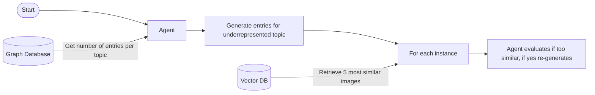

# okgv, organizing knowledge: graphs and vectors

A system that allows to build a self-organized synthetic knowledge base to train LLMs.

Why?
Coding agents can be used to generate instances that can be used to train/fine-tune a LLM. However, as the number of entries grows it is difficult to keep trace of the already covered topics/categories to
avoid redundancies and ensure coverage of all the examples of interest.

How?
Every entry is grouped into a topic, the agent can be prompted to expand underrepresented topics, create new topics or group entries in a topic in further sub-topics. This graph structure can be naturally
handled by a NoSQL database. To avoid redundancies in the generated instances within a certain topic (or sub-topic) the agent receives feedback on generated instances that are too similar to existing ones.
This similarity computation is performed leveraging a vector database.

## General Structure
The knowledge graph has topics and entries. A topic can have as children both topics and entries. A topic that is child of another topic is called a sub-topic. 

Entries are organized into sub-topics when they exceed a certain number, defined as a custom threshold value (or follow other rules, maybe agent should guide). Organization of an entry into a sub-topic is handled via clustering.
Root topics are defined a-priori, meaning that the generation phase of entries that belong to a topic that is not in the knowledge base must be intentional. This implies that entries without
a parent topic cannot exist in the knowledge base.

The knowledge base makes use of two components:
- Neo4j: used to handle relationships between topics, sub-topics and entries. 
- Weaviate: stores entries content and vector representation.

### Neo4j
Every node has a set of metadata that helps to identify it.

Entry nodes:
- a unique id, obtained via uuid5 hashing of the content of the node.
- Custom metadata, defined by user.
- Optionally, for visual inspection, the actual content of the dataset entry. 

Topic/Sub-topic nodes:
- number of children (only entry nodes are counted, meaning that if a topic node has a child sub-topic which has 10 entry nodes the topic node has 10 children too)

### Weaviate
Used as vector database, it contains the vector representation of every topic and its raw content, identified with the same id used in the graph.

## The generation process
1. User prompts the agent to generate entries in a specific topic  
Compare with the k most similar examples within the reference topic/sub-topic node and check if not redundant

Every session of the process adds a set of nodes, which are identified by their ids. To allow undoing insert operations a log.json file is kept with timestamp as key and list of inserted node ids as values.
