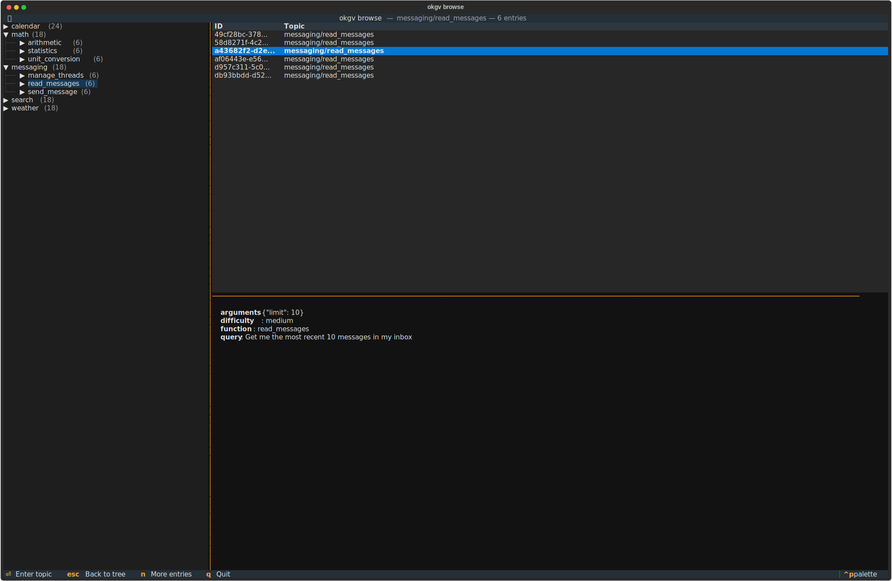

# Architecture & Internals

## Storage

Single storage layer:

- **SQLite** (`okgv.db`): topics, entries, vectors (via [sqlite-vec](https://github.com/asg017/sqlite-vec)), submission log, review state. All local, zero setup, fully portable single file.

Every entry is identified by a deterministic UUID5 (computed from canonical JSON of the entry content).

Use `okgv tree` to visualize the topic hierarchy in the terminal.

## Topic Structure

Topics form a tree with path-based identity:

```
algebra                          → path: "algebra"
├── linear_algebra               → path: "algebra/linear_algebra"
│   ├── basics                   → path: "algebra/linear_algebra/basics"
│   └── advanced                 → path: "algebra/linear_algebra/advanced"
└── abstract_algebra             → path: "algebra/abstract_algebra"
```

Entries attach to **leaf** topics only — submission to a node that has children is rejected, since an entry on an interior node is unclassified along the child dimension. Topic queries (counts, listings, stats) are recursive: querying `algebra` includes entries under all its descendants. Similarity search defaults to the exact target topic but can widen to the subtree per node (see [Similarity Scoping](#similarity-scoping)).

### Tree TUI
```bash
# Terminal UI for tree structure (requires: pip install okgv[tui])
okgv tree -i
```


## Node Constraints (`_meta`)

A structure-file node may carry a reserved `_meta` block describing constraints on the entries placed under it. `create-structure` parses each block through the validator registry and **folds** the blocks along every root-to-leaf path (`okgv/specs.py`) into one effective `Spec` per topic, with three merge classes: constraints by conjunction (narrowing only; a contradiction is an ingest error), policy (`similarity_scope`, nearest ancestor wins), and identity (`function`, set once). A malformed validator, a contradictory fold, or a redeclared function fails at ingest, before anything is written.

Enforcement is a schema concern: the optional `validate_for_topic(entry, topic)` hook (`okgv/core.py`) runs on every `submit`/`submit-batch`, on the destination of every `move`, and on every entry checked by `revalidate`. The example schema reads the folded `Spec` for the topic and checks the entry's function and arguments against it. Specs are also exposed in-memory via `Session.effective_spec(topic)`, and `entry-prompt --topic` renders fields narrowed through each validator's `narrow()`. Backward compatible: a structure with no `_meta` folds to empty specs and behaves exactly as before.

## Similarity Scoping

**Similarity search defaults to the exact target topic, configurable per node via `similarity_scope`.** When checking for duplicates before submitting to `topic1/sub_topic1`, only entries already in `topic1/sub_topic1` are compared by default (`leaf` scope). A node may declare `"similarity_scope": "subtree"` to also compare against descendants and siblings under the split; `get_top_n` then prefix-filters via an `id IN (...)` prefilter (vec0 KNN allows only equality/range on metadata columns, so `LIKE`/`OR` is pushed into the prefilter), and matches in other topics are tagged `sibling: true` so an agent treats them as variants rather than automatic rejections.

Leaf scope is by design for performance (native sqlite-vec pre-filtering) and correctness (each topic has its own semantic scope). It means:

- **Same topic name, different parent = fine.** `dogs/legs` and `cats/legs` both contain "legs" entries but about different animals, no cross-dedup needed.
- **The full path determines semantic scope.** A well-structured topic tree naturally avoids ambiguity.
- **Overlapping siblings.** If `anatomy/limbs` and `dogs/legs` could contain similar entries, either design the tree so each leaf has a clear, non-overlapping scope, or set `similarity_scope: subtree` on their parent (`create-structure` warns about overlapping siblings with no explicit scope).

## Session Logging

Every `submit` appends to `okgv.db` (SQLite with WAL mode). The same file stores the graph (topics + entries), vectors (embeddings via sqlite-vec), submission log, and review queue.

```
log table:
| id | timestamp                    | topic           | entry_id |
|----|------------------------------|-----------------|----------|
| 1  | 2025-01-15T12:00:00+00:00    | algebra/basics  | uuid1    |
| 2  | 2025-01-15T12:00:00+00:00    | algebra/basics  | uuid2    |

review table:
| entry_id | topic          | status   | created_at                  | reviewed_at                 |
|----------|----------------|----------|-----------------------------|-----------------------------|
| uuid1    | algebra/basics | approved | 2025-01-15T12:00:00+00:00   | 2025-01-15T14:00:00+00:00   |
| uuid2    | algebra/basics | pending  | 2025-01-15T12:00:00+00:00   |                             |
```

Query with `okgv log`. Timestamps are stored in UTC, displayed in local time. Used by `undo` to roll back submissions.

## Reliability

### Batch Operations

`submit-batch` and `similar-batch` load the embedding model once and process all entries with a single model load.

`undo` and `reconcile` also use batch deletes.

### Consistency

All data lives in a single SQLite database (`okgv.db`). Graph entries and vector entries share the same connection, and commands that write to both stores (`submit`, `submit-batch`, `move-topic`, `move-entry`) wrap their writes in a single SQLite transaction: either both land or neither does. Embeddings are computed before any write, so an embedding failure leaves the database untouched.

The submission log and review queue use a separate connection, so they are updated after the entry transaction commits. `okgv reconcile` remains available to detect and fix inconsistencies between graph and vector tables (for example, from a database modified by external tools).
