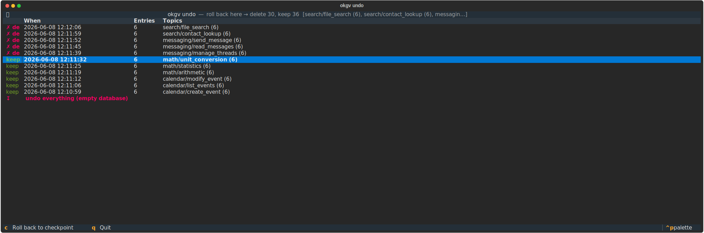

<p align="center">
    
    
</p>

# Commands

All output is JSON to stdout. Logs go to stderr.

| Command | Purpose |
|---------|---------|
| `init` | Scaffold project: `.env`, `generation-guide.md`, `config/` (schema.py, validators.py, structure.json), `prompts/` (schema-guide, reviewer-prompt, structure-prompt). `--template <preset>` picks a starting point (`default`, `classification`, `qa`, `function-calling`, `rag`, `paraphrase`), `--list` shows them. Existing files are never overwritten |
| `cli-prompt` | Print agent instructions for using the CLI |
| `entry-prompt` | Print entry field descriptions and constraints for the agent. `--topic <path>` narrows fields to a topic's effective spec and appends its function/argument signature |
| `validators` | List validator tags available in `_meta` (built-in + custom from `OKGV_VALIDATORS`), with the exact form to write for each and whether it is analyzable |
| `get-structure` | Topic/subtopic tree as nested JSON. `--root`, `--depth` to scope |
| `get-depth` | Max depth of topic tree. `--root` to measure from specific topic |
| `create-topic` | Create topic by path. `--parents` for mkdir -p behavior |
| `create-structure` | Create topic tree from JSON file. Parses `_meta` constraint blocks; warns when re-run over a populated DB |
| `least-topic` | Child topic with fewest entries. `--topic` scopes to parent |
| `topic-stats` | Entry counts grouped by metadata fields |
| `report` | Dataset-wide balance report: counts per leaf topic × balance-field value, including empty cells |
| `similar` | Top-N similar entries. Scope follows the topic's `similarity_scope` (`leaf` default; `subtree` also searches siblings, tagging cross-topic matches `sibling: true`) |
| `similar-batch` | Batch similarity search (single model load) |
| `submit` | Upsert entry into both tables (leaf topics only). `--review` to flag for review. `--overwrite` re-derives in place and cannot relocate (use `move-entry`) |
| `submit-batch` | Batch upsert (single model load). `--review` to flag for review |
| `move-topic` | Move topic/subtopic under different parent. Revalidates moved entries against their new paths. `--dry-run` to preview |
| `move-entry` | Move entry to different topic. Revalidates against the destination spec. `--dry-run` to preview |
| `tree` | Visualize topic tree. `--counts`, `-i` interactive browser, `--export dot\|json` |
| `get-by-topic` | Fetch sample entries for a topic |
| `get-vector` | Fetch entry from the vector table by ID |
| `get-graph` | Fetch entry from the graph table by ID |
| `review` | Query review queue. `-i` for interactive UI, `--export`/`--import` for batch, `--purge-rejected`/`--recover-rejected` |
| `approve` | Mark entry as approved in review queue |
| `reject` | Mark entry as rejected in review queue |
| `log` | Query submission log. `--topic`, `--after`, `--before`, `--count` |
| `undo` | Delete entries submitted after a timestamp. `-i` opens an interactive checkpoint timeline (pick where to roll back to). `--dry-run` to preview |
| `reconcile` | Find and fix orphan entries across the graph and vector tables. `--dry-run` to preview |
| `revalidate` | Report entries that violate their topic's current effective spec (after tightening `_meta`) and queue them for review. `--topic` to scope, `--no-queue` to only report |
| `export` | Export all entries to JSONL. `--fields`, `--exclude-in-review`, `--split` for stratified train/val/test, `--dry-run` |
| `purge` | **Hidden.** Delete everything (entries, topics, log). Requires `--confirm "delete all"` |

## Examples

```bash
# Explore topic structure
okgv get-structure
okgv get-structure --root algebra --depth 2
okgv get-depth

# Create topic tree
okgv create-topic --name algebra/linear_algebra/basics --parents

# Or from file
okgv create-structure --file config/structure.json

# Find underrepresented area
okgv least-topic --topic algebra
# {"topic": "algebra/linear_algebra/basics", "count": 3, "all_counts": {...}}

# Analyze coverage gaps within one topic
okgv topic-stats --topic algebra --fields "difficulty"

# Dataset-wide balance report: every leaf topic × balance-field value,
# empty cells included (values declared by OneOf validators count even
# if never generated). Scope with --topic, override fields with --fields.
okgv report
okgv report --topic algebra --fields "difficulty"

# Check similarity before submitting.
# --entry takes the complete candidate entry (the same JSON you would submit),
# so the check embeds exactly what submit would embed.
okgv similar --topic algebra/linear_algebra --entry '{"question": "...", "answer": "...", "difficulty": "medium"}' --top-k 5

# Submit (with optional review flag)
okgv submit --topic algebra/linear_algebra/basics --entry '{"question": "...", "answer": "...", "difficulty": "easy"}' --review

# Batch operations (single model load)
okgv submit-batch --topic algebra --entries '[{"question": "...", "answer": "...", "difficulty": "easy"}, {"question": "...", "answer": "...", "difficulty": "hard"}]'

# Move a subtopic
okgv move-topic --source algebra/basics --destination geometry

# Review entries
okgv review -i --topic algebra          # interactive terminal UI
okgv review --topic algebra --count        # counts by status
okgv review --export review.json           # export for offline review
okgv review --import review.json           # import decisions
okgv approve --id <uuid>                   # approve single entry
okgv reject --id <uuid>                    # reject single entry
okgv review --purge-rejected --dry-run     # preview rejected cleanup
okgv review --purge-rejected               # delete rejected from all tables
okgv review --recover-rejected --dry-run   # preview recovery
okgv review --recover-rejected             # set rejected back to pending

# Export for training
okgv export --output dataset.jsonl
okgv export --output dataset.jsonl --fields "question,difficulty" --exclude-in-review

# Stratified train/val/test split: each split keeps the dataset's
# topic × balance-field distribution. Deterministic for a given --seed.
okgv export --output dataset.jsonl --split "train=0.8,val=0.1,test=0.1" --seed 42
# → dataset-train.jsonl, dataset-val.jsonl, dataset-test.jsonl

# Preview the split first: per-split counts and balance-field distribution
okgv export --dry-run --split "train=0.8,val=0.1,test=0.1"
# {"splits": {"train": {"count": 77, "balance": {"difficulty": {"easy": 26, ...}}}, ...}}

# Query submission log
okgv log
okgv log --topic algebra --limit 50
okgv log --after 2025-01-15T00:00:00
okgv log --count

# Undo recent submissions
okgv undo 2025-01-15T12:00:00
okgv undo -i                               # interactive: pick a checkpoint to roll back to
```



```
# Find and fix cross-DB inconsistencies
okgv reconcile --dry-run
okgv reconcile
okgv reconcile --batch-size 500

# Nuclear option (hidden command)
okgv purge --confirm "delete all" --dry-run
okgv purge --confirm "delete all"
```

## Agent Workflow

```
1. okgv cli-prompt + okgv entry-prompt
   → learn CLI usage and entry field requirements

2. okgv get-structure
   → understand topic layout

3. okgv report
   → counts per leaf topic × balance-field value, empty cells included
   → pick an empty or low-count cell as the target
   (okgv least-topic --topic <parent> for a quick single answer at one
    level, raw counts only, ignores balance fields)

4. Agent generates candidate entry (LLM call)

5. okgv similar --topic <topic> --entry '<json>'
   → top-N most similar entries WITH FULL CONTENT
   → agent decides: novel enough → submit, too similar → regenerate

6. okgv submit --topic <topic> --entry '<json>' [--review]
   → upserted into both tables, logged to okgv.db
   → optionally flagged for review

7. Repeat 4-6 until the target cell is filled, re-run okgv report
   to pick the next target; final okgv report verifies balance
```

## Error Handling

Errors go to stderr as structured JSON:

```json
{
  "error": "missing_field",
  "detail": "Entry JSON missing required key: 'text'",
  "suggestion": "Ensure entry has \"text\" field"
}
```

Exit codes:

| Code | Meaning |
|------|---------|
| 0 | Success |
| 1 | General failure |
| 2 | Usage/input error |
| 3 | Resource not found |
| 4 | Connection error |
