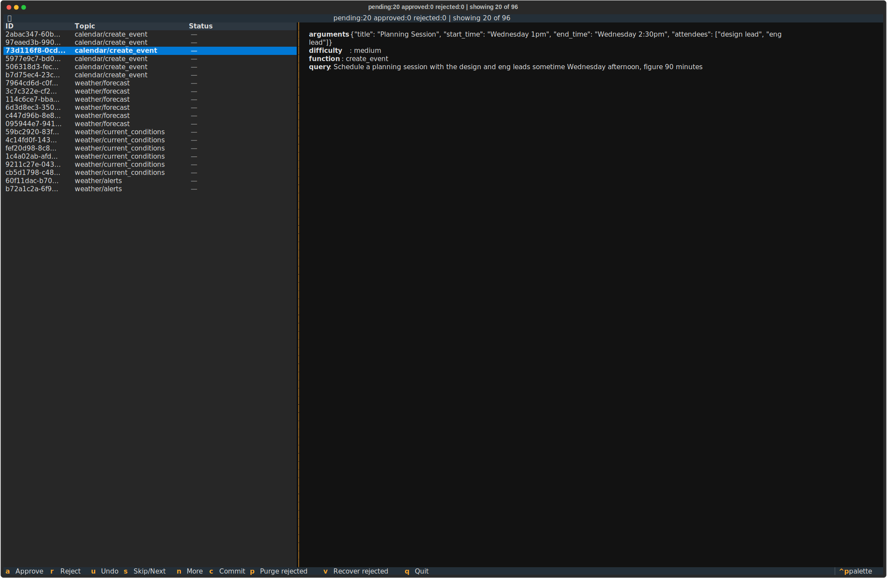

# Review System

Entries can be flagged for review at submit time. Review is an external tracking layer, it does not block entry insertion. Entries always go into both tables immediately.

All review commands are CLI-based, so both humans and agents can drive review. This enables multi-agent pipelines: one agent generates entries, another reviews them for quality, consistency, or adherence to constraints.

## Review modes

- `OKGV_REVIEW=none` (default): entries skip review unless `--review` is passed
- `OKGV_REVIEW=all`: all entries flagged for review unless `--no-review` is passed

## Review workflow

**Via CLI** (agents or humans):
```bash
okgv review --topic algebra              # list pending entries
okgv review --topic algebra --count      # counts by status
okgv approve --id <uuid>
okgv reject --id <uuid>
okgv review --recover-rejected           # set rejected back to pending
okgv review --purge-rejected             # delete rejected from all tables
```

```bash
# Or export → edit → import
okgv review --export review.json --topic algebra
# edit status field in review.json
okgv review --import review.json
```

**Via interactive TUI** (humans only):

```bash
# Terminal UI with staged changes (requires: pip install okgv[tui])
okgv review -i
```


**TUI keyboard shortcuts:**

| Key | Action |
|-----|--------|
| `a` | Approve entry (toggle, press again to revert to pending) |
| `r` | Reject entry (toggle) |
| `u` | Undo mark (revert to pending) |
| `s` | Skip / next entry |
| `c` | Commit all staged decisions to DB |
| `p` | Purge rejected entries from all tables (press twice to confirm) |
| `v` | Recover rejected entries (set back to pending) |
| `q` | Quit and discard unsaved changes |

Decisions are staged locally, nothing is written until `c` is pressed. Entries stay visible in the table with colored status indicators. The status bar shows pending/approved/rejected counts and unsaved changes.

## Review states

| Status | Meaning |
|--------|---------|
| `pending` | Awaiting review |
| `approved` | Reviewed and kept |
| `rejected` | Reviewed and marked for deletion |

Rejected entries remain in DBs until `okgv review --purge-rejected` is run. Use `okgv review --recover-rejected` to set them back to pending instead. `undo` and `purge` also clean up review state.
