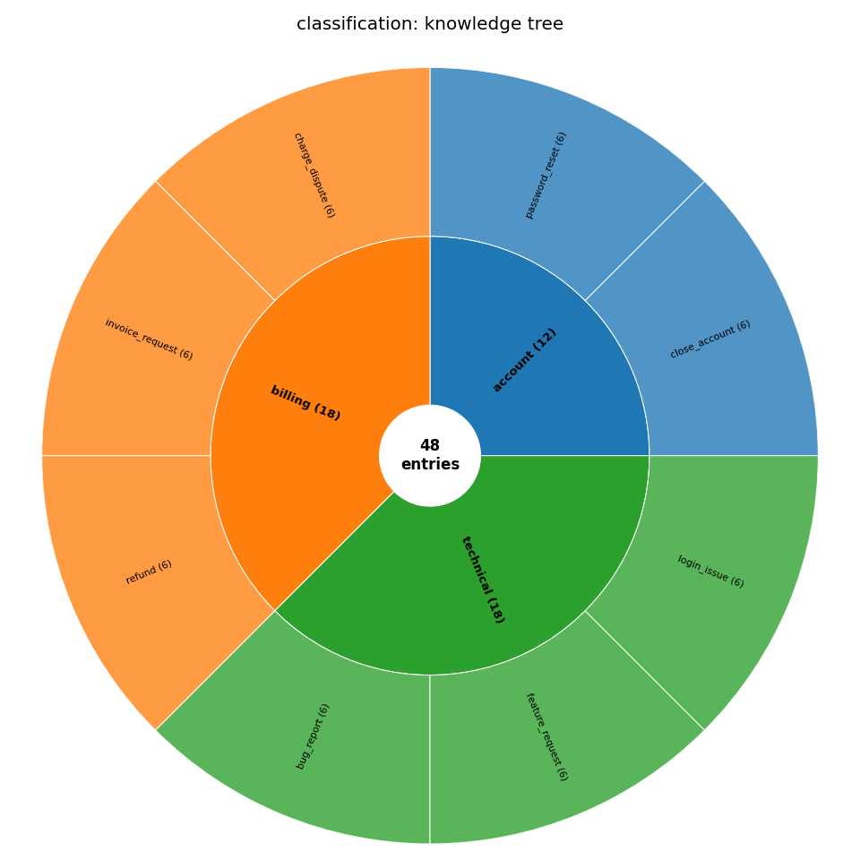
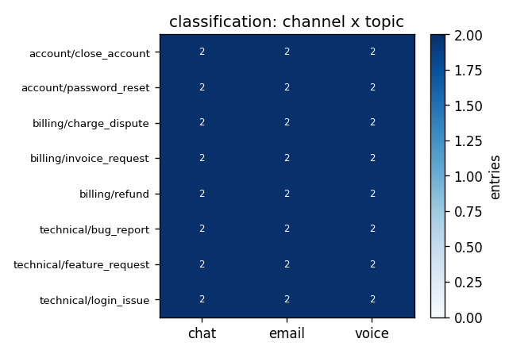
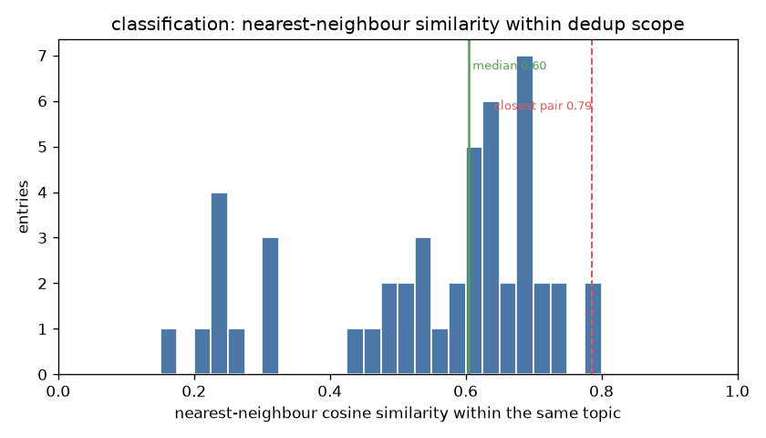
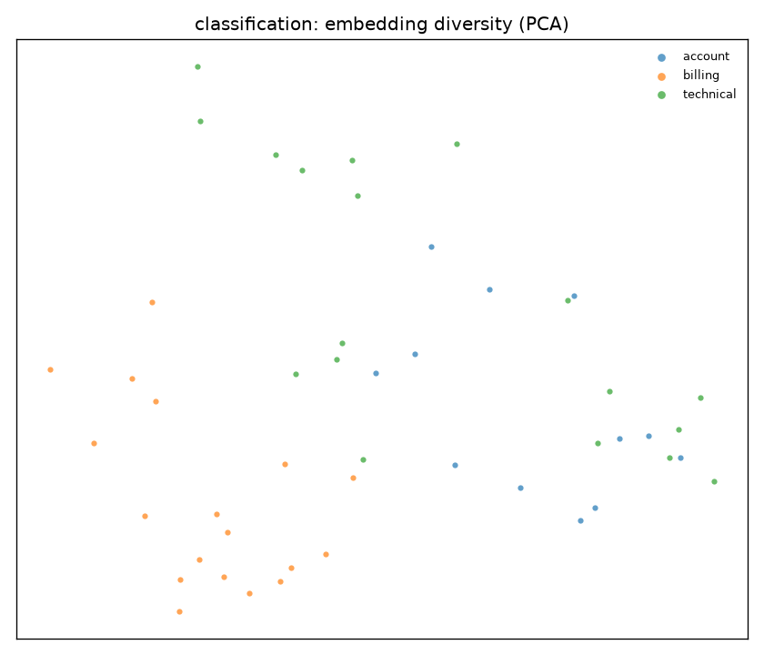
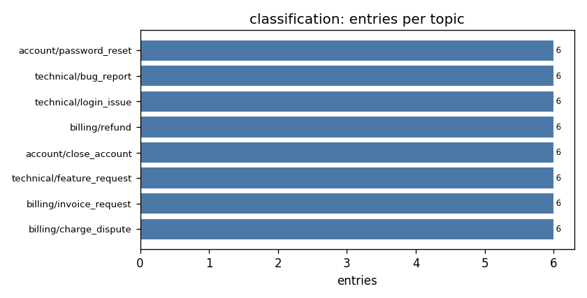

# Example: Intent Classification

A labeled dataset of customer-support utterances for fine-tuning an intent classifier. This is the **simplest okgv shape**: the leaf topic *is* the label, so the topic tree carries the intent and there is no `_meta` at all.

Coding agent used: Claude Code, Sonnet 4.6 - medium effort.


## The dataset

`dataset.jsonl`, 48 entries. Each is a user message filed under its intent:

```json
{"id": "...", "topic": "billing/charge_dispute", "channel": "voice",
 "text": "there's a charge from you guys for like fifty bucks that I have no idea what it's for"}
```

- `topic`: the intent (`billing/refund`, `technical/bug_report`, …); the label **is** the location in the tree
- `text`: the utterance
- `channel`: `chat` | `email` | `voice`, the axis the dataset is balanced on

## How it was built

An agent built the whole set from [`generation-guide.md`](generation-guide.md), driving the okgv CLI itself (with no review round): find the least-covered intent × channel cell, draft an utterance, check it isn't a near-duplicate of what's already under that intent, submit. The full agent session is in **[`chat.txt`](chat.txt)**. 

## The result

The dataset stayed **balanced** and **free of near-duplicates**.



*The intent tree as a sunburst: inner ring is `billing` / `technical` / `account`, outer ring the leaf intents, each wedge sized by entry count.*

`config/structure.json` has no `_meta`, so okgv's similarity check is scoped to each leaf intent only, it never compares across, say, `billing/refund` and `billing/charge_dispute`.



*Entries per intent × channel: the agent kept every cell filled without tracking counts itself.*

**Warning**: in this example the deduplication within leaf nodes is purely emergent: it's the structure + instruction the agent was prompted with, not anything okgv's similarity checks enforced (structure was empty and agent submitted a batch per leaf). For the case where agent used okgv similarity, see [`rag/`](../rag/), where `similarity_scope: subtree`.



*The dedup test, measured directly: each utterance's nearest neighbour **within its own intent** (okgv's dedup scope). The median is ≈ 0.60 cosine and even the single closest pair across all 48 entries only reaches 0.79, no near-duplicate utterances slipped past the `similar` checks.*



*A 2-D PCA of the embeddings, coloured by intent, an illustrative "spread" view.*



## How it's wired

`.env` points okgv at the schema and embedding model:

```bash
OKGV_SCHEMA=config.schema:UtteranceSchema
EMBED_MODEL=sentence-transformers/all-MiniLM-L6-v2
```

`config/schema.py` (`UtteranceSchema`) defines the entry (`text` + `channel`), balances on `channel`, and embeds `text` for the novelty check. `config/structure.json` is just the intent tree, **no `_meta`**, because the leaf path already is the label. `prompts/` holds the agent guides for each phase.

## Reproduce

`okgv.db` is not checked in. To rebuild from scratch:

```bash
cd classification
pip install "okgv[embeddings]"
okgv create-structure --file config/structure.json
claude "read generation-guide.md and start generating"   # the agent loop
okgv export --output dataset.jsonl                        # export the result

pip install -r ../requirements.txt && python ../viz.py classification   # regenerate the charts
```
