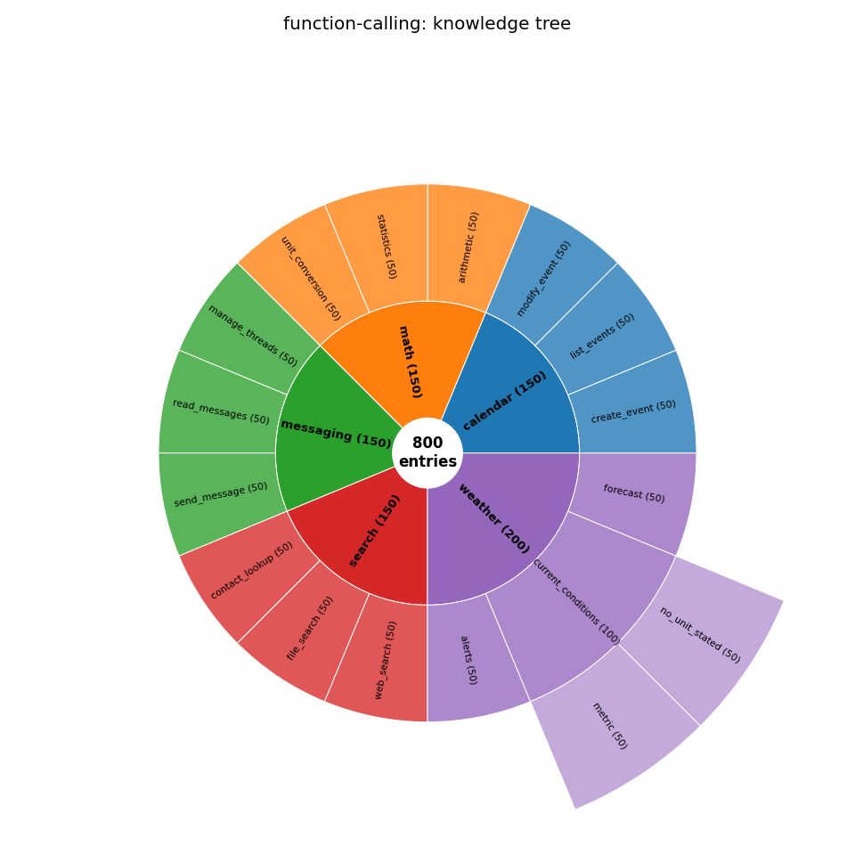
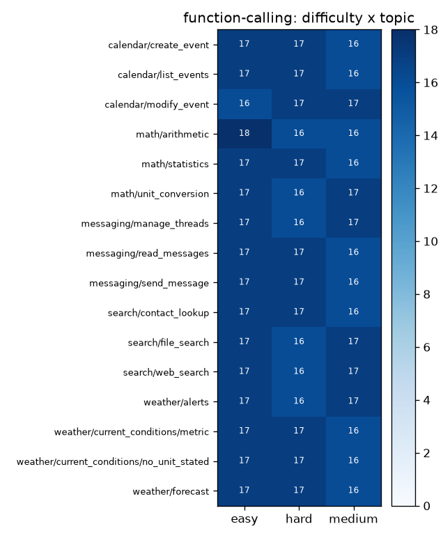
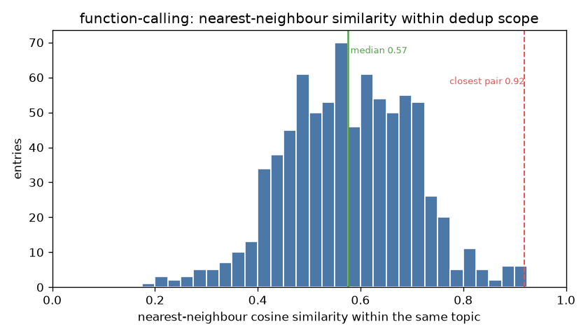
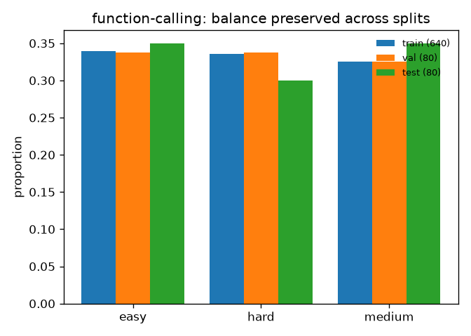
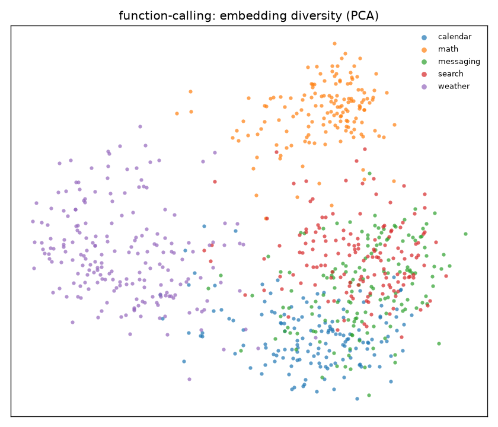
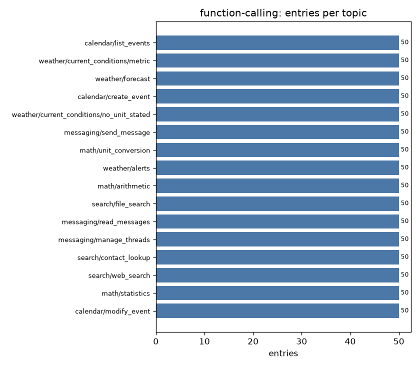

# Example: Function Calling / Tool-Use

A synthetic tool-use dataset, the **deepest okgv shape**. Each entry pairs a user query with the correct function call (name + arguments), and every leaf topic declares its **function contract** in a `structure.json` `_meta` block that okgv enforces on each submission.

Coding agent used: Claude Code, Sonnet 4.6 - medium effort.


## The dataset

`dataset-{train,val,test}.jsonl`, 800 entries, stratified 640 / 80 / 80. Each one:

```json
{"id": "...", "topic": "math/statistics", "function": "compute_stats",
 "arguments": "{'data': [7, 2, 9, 4, 1], 'operation': 'median'}",
 "difficulty": "easy", "query": "What's the median of 7, 2, 9, 4, 1?"}
```

- `query`: natural user request
- `function`: the function name (must match the leaf's contract)
- `arguments`: extracted parameters (validated against the contract: required keys present, no unknowns, values constrained)
- `difficulty`: `easy` | `medium` | `hard`, the balance axis
- `topic`: the function, e.g. `math/statistics`

## How it was built

An agent built it from [`generation-guide.md`](generation-guide.md) (which carries the full function signatures), driving the okgv CLI (with no review round): pick the least-covered function × difficulty cell, write a query and the matching call, verify it's novel and satisfies the topic's contract, submit. The full agent session is in **[`chat.txt`](chat.txt)**.

## The result



*The function tree as a sunburst, three rings deep: domain (`weather`, `calendar`, …), function, then the per-leaf variants that narrow the `_meta` contract, e.g. `weather/current_conditions/metric` and `…/no_unit_stated`. Wedge size is entry count.*

`config/structure.json`'s `_meta` blocks only declare function contracts, none set `similarity_scope`, so okgv's similarity check stays scoped to each leaf (e.g. `weather/current_conditions/metric` vs `…/no_unit_stated` are never compared to each other).



*Every function × difficulty cell holds 16–18 entries.*



**Warning**: in this example the deduplication within leaf nodes is purely emergent, it's the structure + instruction the agent was prompted with, not anything okgv's similarity checks enforced (structure was empty and agent submitted a batch per leaf). For the case where agent used okgv similarity, see [`rag/`](../rag/), where `similarity_scope: subtree`.

*The dedup test: each query's nearest neighbour **within its own function topic** (okgv's dedup scope). The median is ≈ 0.57 cosine and the single closest pair across all 800 entries tops out at 0.92, with almost no mass above 0.85.*



*`okgv export --split` is stratified: train / val / test keep the same difficulty mix as the whole.*



*A 2-D PCA of the query embeddings, coloured by domain, an illustrative "spread" view. PCA is linear and dedup is enforced per leaf, so related domains (calendar / messaging / search) overlap here.*



## How it's wired

`.env`:

```bash
OKGV_SCHEMA=config.schema:ToolCallSchema
EMBED_MODEL=sentence-transformers/all-MiniLM-L6-v2
OKGV_REVIEW=all
```

The global field validators in `config/schema.py` (`ToolCallSchema`) are the baseline every entry meets. The **per-topic** rules, which `function` a topic expects, which arguments are required/allowed, are not hardcoded; they live in `config/structure.json` `_meta`, folded root-to-leaf. For `weather/current_conditions`:

```json
"_meta": {
  "function": "get_current_weather",
  "required": {"location": "not_empty"},
  "optional": {"units": {"one_of": ["celsius", "fahrenheit"]}}
}
```

A child can narrow or add but never relax: `weather/current_conditions/metric` pins `units` to `["celsius"]`, `…/no_unit_stated` forbids `units` entirely, and both inherit the parent's `get_current_weather` function and required `location`. `ToolCallSchema.validate_for_topic` enforces the folded contract on submit, so an entry whose function or arguments don't match its topic is rejected. Run `okgv entry-prompt --topic <path>` to see a topic's enforced signature. `prompts/` holds the agent guides for each workflow phase.

## Reproduce

`okgv.db` is not checked in. To rebuild from scratch:

```bash
cd function-calling
pip install "okgv[embeddings]"
okgv create-structure --file config/structure.json
claude "read generation-guide.md and start generating"
claude "read prompts/reviewer-prompt.md and review the pending queue"
okgv export --output dataset.jsonl --split "train=0.8,val=0.1,test=0.1" --seed 42

pip install -r ../requirements.txt && python ../viz.py function-calling   # regenerate the charts
```
