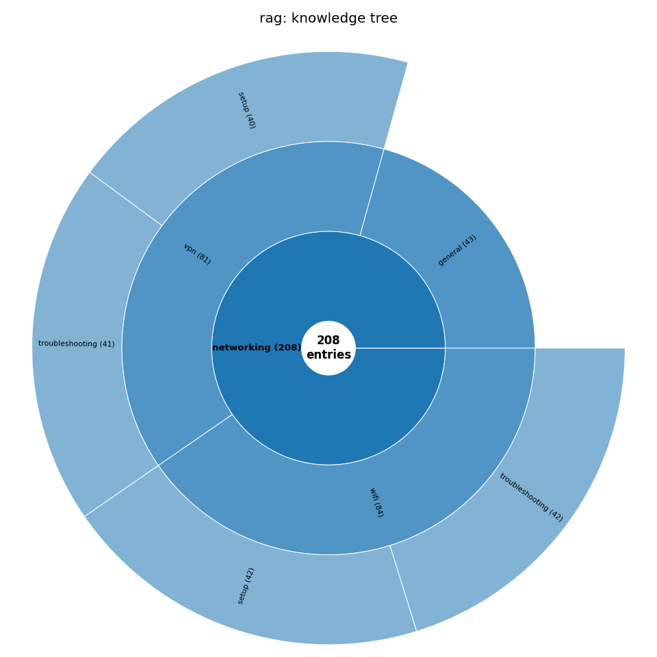
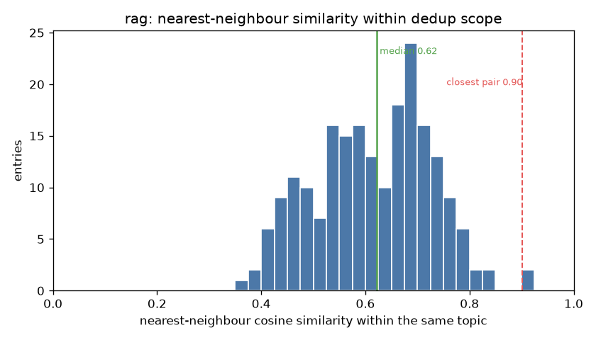
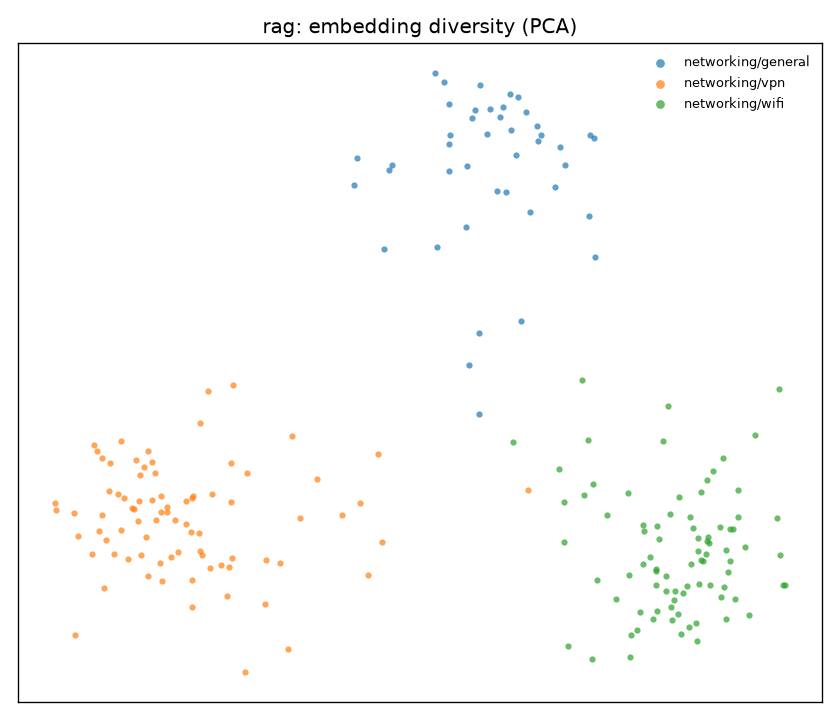
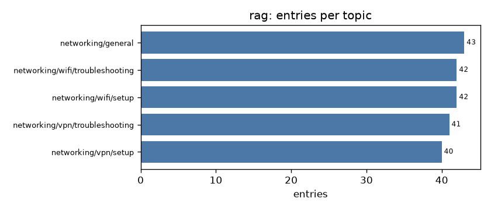

# Example: Retrieval Evaluation

A set of `(query, passage)` pairs for evaluating a retriever. This is the okgv shape that uses **`similarity_scope: subtree`**: sibling topics under `networking/` can produce near-duplicate queries, so deduplication runs across the whole subtree rather than per leaf.

Coding agent used: Claude Code, Sonnet 4.6 - medium effort.


## The dataset

`dataset.jsonl`, 208 entries:

```json
{"id": "...", "topic": "networking/general",
 "query": "What is the difference between full cone, restricted, and symmetric NAT types?",
 "passage": "Full cone NAT maps an internal IP and port to the same external IP and port…"}
```

- `query`: a natural-language search query
- `passage`: the passage that correctly answers it
- `topic`: where in the document taxonomy it sits

There is no balance field: coverage is by topic only.

## How it was built

An agent built it from [`generation-guide.md`](generation-guide.md), driving the okgv CLI (with no review round). Because `networking/` sets `similarity_scope: subtree`, the novelty check for each new query compared it against the **whole subtree**, not just its leaf, cross-leaf near-matches came back tagged `sibling: true`, so the agent steered away from them. The full agent session is in **[`chat.txt`](chat.txt)**.

## The result



*The `networking/` subtree as a sunburst: `vpn` and `wifi` each split further into `setup` / `troubleshooting`, while `general` stays a single leaf.*



*The dedup test, scoped to the whole `networking/` subtree (rag uses `similarity_scope: subtree`): each query's nearest neighbour **across the subtree**, not just its leaf. The median is ≈ 0.62 cosine and the closest pair across all 208 entries reaches 0.90, subtree-scoped dedup kept near-duplicate queries from neighbouring topics out.*



*A 2-D PCA of the query embeddings, coloured by sub-topic, three clean clusters, an illustrative "spread" view.*



## How it's wired

`.env`:

```bash
OKGV_SCHEMA=config.schema:RetrievalSchema
EMBED_MODEL=sentence-transformers/all-MiniLM-L6-v2
```

`config/structure.json` mirrors the document taxonomy, with one `_meta` line on the shared parent that switches dedup to subtree scope:

```json
"networking": { "_meta": { "similarity_scope": "subtree" }, "vpn": {…}, "wifi": {…}, "general": {} }
```

`config/schema.py` (`RetrievalSchema`) embeds `query` for the novelty check and keeps both `query` and `passage` as content.

## Reproduce

`okgv.db` is not checked in. To rebuild from scratch:

```bash
cd rag
pip install "okgv[embeddings]"
okgv create-structure --file config/structure.json
claude "read generation-guide.md and start generating"
okgv export --output dataset.jsonl

pip install -r ../requirements.txt && python ../viz.py rag   # regenerate the charts
```
